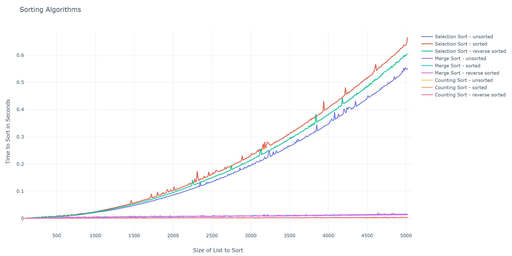

## Sorting Algorithms
Algorithms project that implements, tests and compares three different sorting algorithms using python, pandas, numpy and plotly.  The sorting algorithms are Selection Sort, Merge Sort and Counting Sort.

## Usage  
```
$ git clone https://github.com/Aly-Tomato/SortingAlgorithms.git  
$ cd SortingAlgorithms
$ python3 hw2.py  
```
## Project Write Up
#### Briefly describe your development process. What sources did you use for your algorithms? What programming language did you choose and why?  

I chose to work with Python because I'm at the exciting stage in the language where I'm building useful scripts to automate certain tasks at work while also using the language to analyze data necessary to triage a certain problem at work. I'm relatively new to Python and thought this project would be the best way to better hone in my Python skills as it gave me more time with the language outside of work. I also wanted to get better acquainted with the data analyzing libraries available to Python such as pandas, numpy and plotly as they will be tools I'll be using in a professional setting. Below you will see links to the results of these tests graphed out using the aformentioned tools.

#### Did you run into any difficulties with the implementation? How are you timing the algorithms? What hardware are you timing on?  

The biggest difficulty faced with implementation was learning a new language and exploring the vast libraries python has to offer in data analysis. You may see some C tendencies in the code which I plan on cleaning up later and making the code more _pythonic_. To time the algorithms I used clock as part of the time module to count the ticks that occur during the individual runs of the tests. Per documentation found at https://docs.python.org/2/library/time.html, time.clock() when used on Unix, which is the case here, _"returns the current processor time as a floating point number expressed in seconds."_ The code below demonstrates how I used time.clock() to time the algorithms.

```python
  t1 = time.clock()
  #perform test
  t = time.clock()
  ticks = t -t1
```


#### Graph or tables of the run times of your algorithm implementations on various sized inputs. Do this with sorted and randomized inputs. Do your observations match the theoretical analysis from class? Why or why not?
 The test framework will execute tests for three sorting algorithms: selection sort, merge sort and counting sort. 
I decided to work with these sorting algorithms because I was curious to see them plot out on the graph knowing that each three belong to difference time complexity classes. Selection sort's time complexity is <a href="https://www.codecogs.com/eqnedit.php?latex=O(n^2)" target="_blank"></a>, merge sort's time complexity is <a href="https://www.codecogs.com/eqnedit.php?latex=O(nlog(n))" target="_blank"></a> and counting sort is linear <a href="https://www.codecogs.com/eqnedit.php?latex=O(n)" target="_blank"></a> but there is a space and time trade off that isn't tracked in this study.

[Click to view interactive Plotly line graph results for all sorts with small data sets](https://htmlpreview.github.io/?https://github.com/Aly-Tomato/SortingAlgorithms/blob/master/Graph_4500.html "Default test results link")   
[](https://htmlpreview.github.io/?https://github.com/Aly-Tomato/SortingAlgorithms/blob/master/Graph_4500.html "Default test results image link")

 The default test will execute a total of 4,500 tests. A set of 500 tests are performed with unsorted lists, sorted lists, and reverse sorted lists for each sorting algorithm. The test begins with a list size of 30 and is incremented by 10 as every new test occurs. As you can quickly see in the image above, selection sort's growth is much faster regardless of whether the list is sorted or not after a list size of about 500. **This matches the theoretical analysis from class** as Selection Sort's best and worst case performance is  <a href="https://www.codecogs.com/eqnedit.php?latex=O(n^2)" target="_blank"></a>. By the graphical analysis alone it's hard to tell whether merge sort has a slower of faster performance than counting sort. To better under that relationship I conducted a separate cycle of tests excluding selection sort below.  

[Click to view interactive Plotly line graph results for merge sort & counting sort with large data sets](https://htmlpreview.github.io/?https://github.com/Aly-Tomato/SortingAlgorithms/blob/master/Merge%20%26%20Count%20Sort%20Large%20Set.html "Large test results link")    
[](https://htmlpreview.github.io/?https://github.com/Aly-Tomato/SortingAlgorithms/blob/master/Merge%20%26%20Count%20Sort%20Large%20Set.html "Large test results imagelink")

 Selection sort performed at an alarmingly slow rate as list sizes approached 5,000. Because of this, I decided to omit selection sort from the following test. This test pushed the boundries of merge sort and counting sort to better see how their time performance compares to one another. This test will execute a total of 5000 tests with the size of the lists starting at 1000 and growing until list size of close to 11,000. This was enough to start seeing where these two algorithms start to differ in performance. According to the graph, **merge sort's growth was faster than counting sort's which was expected**. As mentioned above, merge sort's time complexity is <a href="https://www.codecogs.com/eqnedit.php?latex=O(nlog(n))" target="_blank"></a> and counting sort's time complexity is <a href="https://www.codecogs.com/eqnedit.php?latex=O(n)" target="_blank"></a>. The graph clearly shows merge sort's timing split to faster growth as the list sizes approach 11,000. 

#### Comparison of your results with each other. How does each fare under different testing circumstances? Given your results, in what real world situations would you favor one algorithm over the others?
 Given the results it is safe to conclude that selection sort was the poorest performing algorithm of the three. When the data set is small, selection sort will perform roughy within the time frame as merge sort and counting sort. However, as you can see by the interactive graph, selection sort performance starts to grow exponentially at a list size of 200. I was very interested to find that the type of list (sorted, unsorted or reverse sorted) affected the performance of these algorithms. An already sorted list through selection sort showed to be the slowest performing algorithm. It was interesting to see the opposite effect on merge sort as a sorted list was less of a problem for merge sort compared to an unsorted list.  
 
Since this study didn't evaluate the space complexity of these algorithms, counting sort looked like the immediate favorite among the algorithms. In my opinion, most computers these days have a seemingly endless supply of storage. However, counting sort may not always be the right answer for a specific problem. Counting sort will only work for sorting non-negative integers. Consider working for the US Census Bureau and you need to sort through billions of character strings that contain names and demographics. Counting sort will be the poor choice for that problem as the math necessary for the algorithm will not produce favorable results. Of the three sorting algorithms studied for this project, merge sort would be the best sorting algorithm to sort through US Census Bureau data but I would be inclined to see how other sorting algorithms could handle billions of string data. The chances of receiving this data unsorted is high considering that American citizens are turning in their surveys at different times. As we saw in this study, unsorted data slowed merge sort's time performance.   

While counting sort would be an impossible choice for sorting through citizen data, it would be great to sort through ages, inventory and other tangible items that can't theoretically be negative and will always be whole. Selection sort, would be suitable on a problem where limited memory becomes a factor or if the sample size is relatively small. To conclude my answer for _in what real world situations would you favor one algorithm over the others_ I had a lot of fun implementing counting sort. I remember first learning about the algorithm in class and was very surprised that it works. So while it sure has it's _real word_ limitations such as sorting floats and characters, it sure was the most fun to learn about.

## Links

The following are resources used on this project:
* [http://interactivepython.org/courselib/static/pythonds/SortSearch/TheSelectionSort.html](http://interactivepython.org/courselib/static/pythonds/SortSearch/TheSelectionSort.html)
* [http://interactivepython.org/courselib/static/pythonds/SortSearch/TheMergeSort.html](http://interactivepython.org/courselib/static/pythonds/SortSearch/TheMergeSort.html)
* [https://github.com/adam-p/markdown-here/wiki/Markdown-Cheatsheet](https://github.com/adam-p/markdown-here/wiki/Markdown-Cheatsheet)
* [https://plot.ly/create](https://plot.ly/create)
* [http://bigocheatsheet.com/](http://bigocheatsheet.com/)

